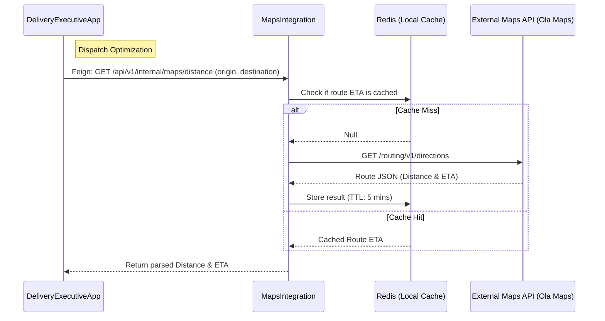

# MapsIntegration Architecture

The MapsIntegration service shields internal services from external provider API changes and rate limits.

## Detailed Sequence Diagram

```mermaid
sequenceDiagram
    participant DeliveryApp as DeliveryExecutiveApp
    participant MapsApp as MapsIntegration
    participant Cache as Redis (Local Cache)
    participant Provider as External Maps API (Ola Maps)

    %% Distance Calculation Flow
    note right of DeliveryApp: Dispatch Optimization
    DeliveryApp->>MapsApp: Feign: GET /api/v1/internal/maps/distance (origin, destination)
    MapsApp->>Cache: Check if route ETA is cached
    
    alt Cache Miss
        Cache-->>MapsApp: Null
        MapsApp->>Provider: GET /routing/v1/directions
        Provider-->>MapsApp: Route JSON (Distance & ETA)
        MapsApp->>Cache: Store result (TTL: 5 mins)
    else Cache Hit
        Cache-->>MapsApp: Cached Route ETA
    end
    
    MapsApp-->>DeliveryApp: Return parsed Distance & ETA
```
