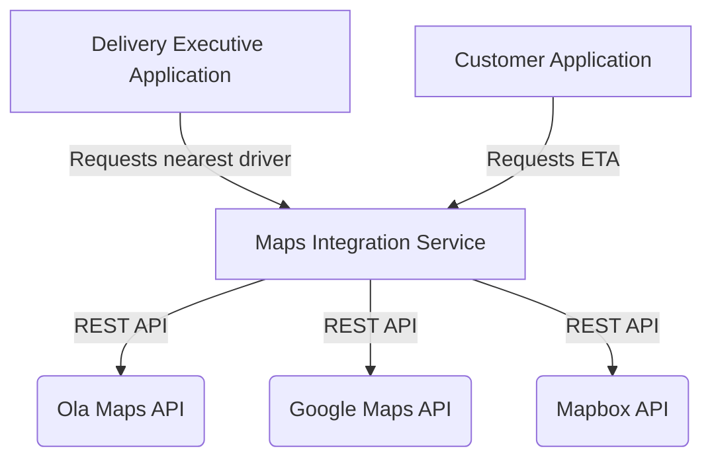

# Maps Integration

The Maps Integration service is responsible for geospatial intelligence in the Food Delivery platform. It wraps external mapping providers (such as Ola Maps, Google Maps, Mapbox) to provide routing, distance calculation, and ETA predictions.

## Responsibilities

1. **Routing**: Calculates optimal routes between restaurants, delivery executives, and customers.
2. **ETA Calculation**: Provides real-time ETAs for deliveries based on traffic and distance.
3. **Geocoding**: Converts raw customer addresses into accurate latitude and longitude coordinates.

## Integration Architecture

## Setup

Run `mvn spring-boot:run` to start the Maps Integration service. Make sure external API keys are configured in your environment properties.
