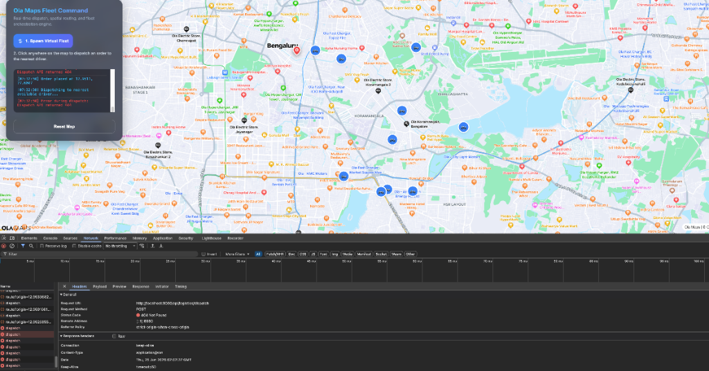
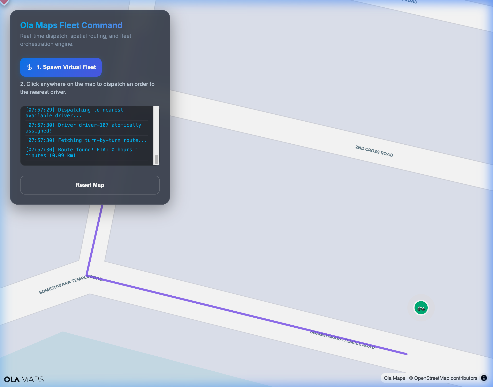

# Ola Maps Fleet Integration

A real-time logistics and dispatch simulation platform powered by **Spring Boot**, **PostGIS**, **Redis**, and the **Ola Maps Web SDK**. This application provides a comprehensive UI and backend infrastructure to assign drivers, calculate accurate road-distance ETAs, and draw turn-by-turn routing polys.



## Features

- **Real-Time Map Visualization**: Powered by MapLibre and the Ola Maps Web SDK.
- **Smart Dispatch**: Automatically calculates distance matrices to find the fastest available driver using the Ola Maps APIs.
- **Live Fleet Tracking**: Drivers ping their coordinates to a WebSocket endpoint, which buffers and flushes them to Redis Geospatial indexes.
- **Resilient Fallbacks**: Circuit Breaker implementations ensure that if the Ola Maps APIs are rate-limited (429) or offline, the system safely falls back to mathematical Haversine calculations.
- **Agent Integration**: Exposes all critical backend features (like fleet discovery and dispatching) as native `@Tool` MCP endpoints for integration with LLM agents.

## Getting Started

### Prerequisites

1. **Java 17+**
2. **Docker** & **Docker Compose**
3. **Ola Maps API Key**: You must have a valid Ola Maps API Key from the Krutrim cloud console.

### Installation

1. Clone this repository.
2. Spin up the backend dependencies (PostgreSQL + PostGIS, and Redis) using Docker Compose:
   ```bash
   docker-compose up -d
   ```
3. Run the Spring Boot Application. Be sure to provide your API key in the environment:
   ```bash
   OLA_MAPS_API_KEY="your-api-key" ./mvnw spring-boot:run
   ```
4. Open your browser to `http://localhost:8080/`.

## Usage

1. **Spawn Virtual Fleet**: Click this button in the UI to instantly spawn 10 drivers throughout Bengaluru. Their status is registered as `AVAILABLE` in Redis.
2. **Dispatch an Order**: Click anywhere on the map!
   - The map will place a marker representing a restaurant/customer.
   - The backend will search Redis for all drivers within a 5km radius.
   - The backend queries the Ola Maps Distance Matrix API to calculate true road distance ETAs for the 10 closest drivers.
   - The nearest driver is atomicaly locked, marked as `UNAVAILABLE`, and assigned the order.
   - A purple polyline route will smoothly animate on the map from the driver to your click location.



## Troubleshooting

- **No available drivers found nearby!**: If you dispatch 10 orders, all 10 drivers will be assigned. Click "Reset Map" and "Spawn Virtual Fleet" again to bring a fresh batch of drivers online.
- **Map Not Loading / 401 Unauthorized**: Ensure your `OLA_MAPS_API_KEY` environment variable was passed successfully to the backend, as the frontend securely fetches it from `/api/config/maps-key`.
- **429 Too Many Requests**: The Ola Maps API has monthly limits. If you hit this, the backend automatically logs a circuit breaker warning and switches to the fallback Haversine method.

## Architecture

For more details on the technical architecture, PostGIS schema, and internal `@Tool` logic, see the `.agent-skills/maps-integration-architecture/SKILL.md` guide.
